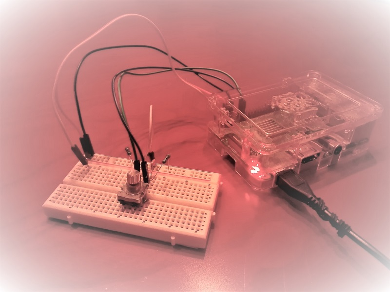
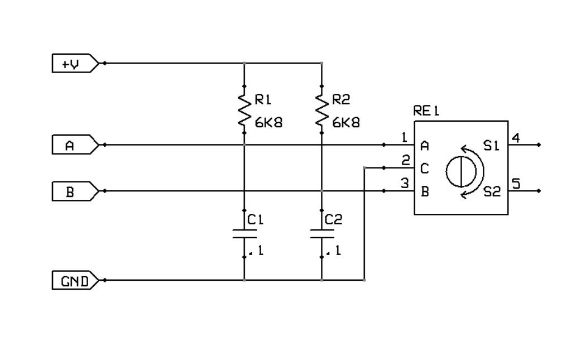

# quadrature encoder eXPerience
Read and count encoded signals from 3-pin incremental rotary encoder.

                  _______         _______         ______
        A _______|       |_______|       |_______|
                      _______         _______         __      
        B ___________|       |_______|       |_______|  

		2x       *       *       *       *       *    

	    4x       *   *   *   *   *   *   *   *   *   *

#### double evaluation:
        (A != A-1) AND (B != A) -> +1
        (A != A-1) AND (B == A) -> -1

#### quadruple evaluation:
        (A != A-1) AND (B != A) -> +1
        (A != A-1) AND (B == A) -> -1
		(A == A-1) AND (B != B-1) AND (B != A) -> -1
        (A == A-1) AND (B != B-1) AND (B == A) -> +1

## Schematic

