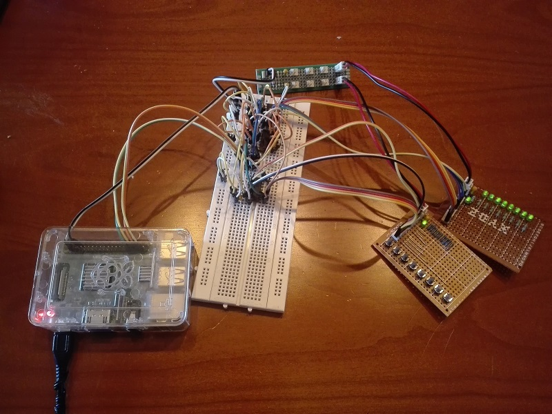
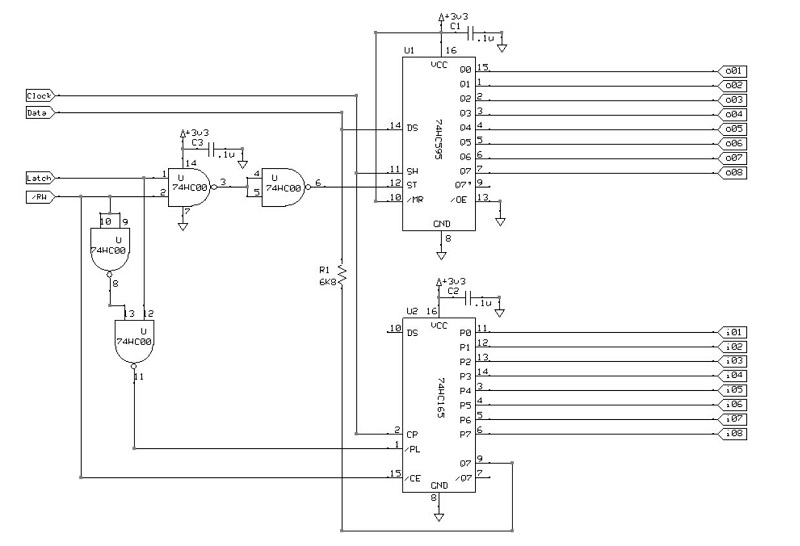

# serial-bus-to-prallel eXPerience
Serial bi-directional bus to parallel input/output, using the 74HC595 for serial-to-parallel output, and the 74HC165 for parallel-to-serial input.

#### SHIFT REGISTERS SIGNALS
Latch signal (positive-edge storage register clock) on 595 SIPO shift register:

	ST = NOT( LATCH NAND /RW ) --> ST = LATCH with /RW = H

Latch signal (negative-edge parallel load clock) on 165 PISO shift register:

	PL = LATCH NAND NOT( /RW ) --> PL = NOT(LATCH) with /RW = L

#### WRITE OPERATION
Initial signals status: LATCH = L, CLOCK = L, /RW = X

    Set DATA as Output
	Set /RW = H
	Repeat for each bit of data:
		Set DATA = X
        Write DATA
		Set CLOCK = L -> H -> L
    Set LATCH = L -> H -> L

#### READ OPERATION
Initial signals status: LATCH = L, CLOCK = L, /RW = X

    Set DATA as Input
	Set /RW = L
	Set LATCH = L -> H -> L
	Repeat for each bit of data:	
		Read DATA
        Set CLOCK = L -> H -> L

## Schematic

## Bill of Materials
- [x] 74HC595 8-bit serial-in/3-state parallel-out shift register
- [x] 74HC165 8-bit parallel-in/serial-out shift register
- [x] 74HC00 quad 2-input NAND gates
- [x] 3 x decoupling capacitor C=100nF
- [x] resistor R=6K8ohm
- [x] module board [mob-io-array-switch-8x](https://github.com/gom9000/xp-mobs-library/tree/master/mobs/mob-io-array-switch-8x)  from *xp-mobs-library* repository
- [x] module board [mob-io-array-led-8x](https://github.com/gom9000/xp-mobs-library/tree/master/mobs/mob-io-array-led-8x)  from *xp-mobs-library* repository
- [x] module board [mob-psu-distribution](https://github.com/gom9000/xp-mobs-library/tree/master/mobs/mob-psu-distribution)  from *xp-mobs-library* repository