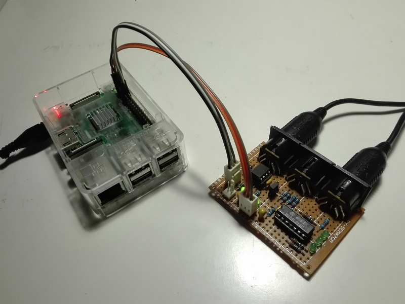

# serial-midi

## Settings (pi3)
Add at the end of **/boot/config.txt**

	# enable UART on GPIOs 14 & 15
	enable_uart=1
	# move bluetooth to the ttyS0 weaker UART
	dtoverlay=pi3-miniuart-bt
	# set Serial MIDI at 31250 when using 38400 baudrate
	dtoverlay=midi-uart0

Remove from **/boot/cmdline.txt**

	console=serial0,115200

Change from **raspi-config** menu: Interfacing Options

	disable serial login shell
	enable serial port hardware

## Schematic
none

## Bill of Materials
- [x] module board [mob-if-midi](https://github.com/gom9000/xp-mobs-library/tree/master/mobs/mob-if-midi)  from *xp-mobs-library* repository